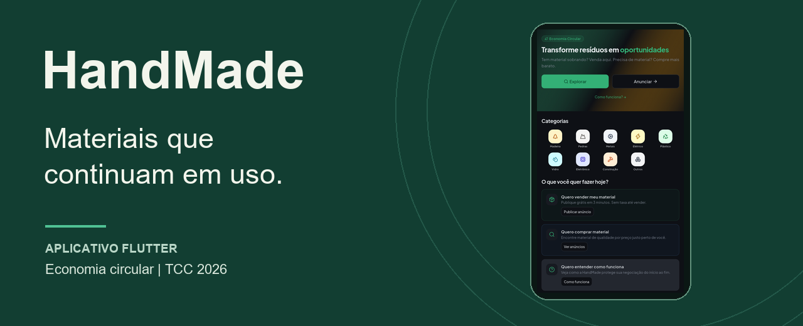
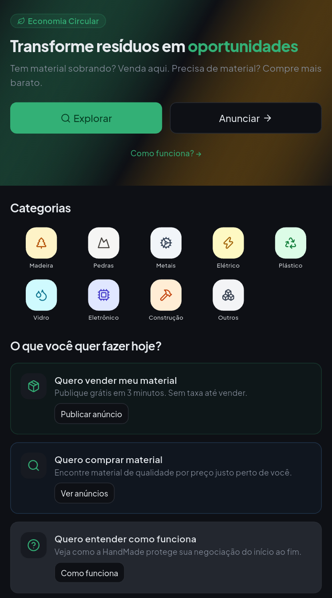

# HandMade

**Um marketplace para dispositivos móveis que conecta quem tem materiais reutilizáveis a quem precisa deles.**

Sobras de reformas, excedentes e materiais em bom estado podem encontrar novos usos. O HandMade reúne descoberta de anúncios, conversa, negociação e acompanhamento de pedidos em um aplicativo Flutter funcional.

Projeto de TCC da **Etec Euro Albino de Souza**, em Mogi Guaçu–SP. Esta é a apresentação pública do produto e do trabalho de engenharia da equipe.

[Aplicativo e telas](docs/aplicativo.md) · [Evolução e método](docs/evolucao-e-metodo.md) · [Engenharia](docs/engenharia.md) · [Resultados](docs/resultados.md)

## O produto hoje

**Android em Development, com distribuição restrita a testadores.** Backend Firebase implementado e pagamentos exclusivamente em Stripe TEST/Sandbox. Ainda não é uma operação comercial nem uma publicação em loja.

- **Encontrar materiais:** catálogo, busca e filtros, detalhes e favoritos.
- **Anunciar:** fotos, descrição, modalidade, preço e gerenciamento dos próprios anúncios.
- **Negociar:** chat, propostas e acompanhamento dos pedidos.
- **Acompanhar:** notificações do sistema, estados de leitura e histórico das operações.
- **Gerenciar a conta:** perfis para pessoas e empresas, planos, ajuda e recursos de privacidade.

  

*Captura real do aplicativo em ambiente de testes. Veja também cadastro, negociação e planos na [galeria](docs/aplicativo.md).*

## Resultados que conseguimos verificar

- **590 testes aprovados:** aplicativo, backend, regras de acesso e integração, na entrega de setembro de 2026.
- **APK 42,51% menor:** 91,87 → 52,81 MB, comparando builds equivalentes em modo *profile*.
- **24 combinações de interface:** larguras, escalas de texto e temas claro/escuro na avaliação dos planos.

Os números têm escopo definido. [Métodos, amostras e limites das medições](docs/resultados.md) acompanham os resultados; não representam cobertura total de testes nem garantia de desempenho em qualquer aparelho.

## Do protótipo à aplicação

**Problema e pesquisa → prototipação → avaliação e ajustes → Flutter e backend → testes e distribuição → otimizações.**

O protótipo React/Vite/TypeScript serviu para explorar interface e fluxos. O aplicativo atual implementa persistência, integrações e operações reais em ambiente de desenvolvimento.

**[Explorar o protótipo histórico](https://handmade-b0f.pages.dev/)** — a identificação “5.0” pertence ao protótipo. É uma simulação para navegação: não insira dados pessoais nem realize pagamentos. As telas acima pertencem ao aplicativo Flutter.

## Competências demonstradas

Flutter e Dart no aplicativo; Firebase e Cloud Functions no backend; TypeScript nas funções; busca com Algolia; pagamentos de teste com Stripe. O processo inclui modelagem, testes automatizados, validação em Android, revisão de interface, integração contínua e distribuição controlada.

As [decisões de engenharia](docs/engenharia.md) explicam as responsabilidades dessas tecnologias em alto nível. A [metodologia](docs/evolucao-e-metodo.md) relaciona requisitos, evidências e evolução do produto.

## Equipe e contexto acadêmico

| Integrante | Frente de atuação no projeto |
| --- | --- |
| **Vinícius Santana dos Santos** | Liderança de desenvolvimento, back-end e integrações; coordenação e documentação |
| **Nathan Costa Batista** | Front-end, prototipação e UI/UX |
| **Yago Smith da Silva** | Pesquisa, viabilidade e estudo de mercado |
| **Thomaz de Moraes Teixeira** | Modelagem, testes e aspectos legais |

**Curso:** Ensino Médio Integrado ao Técnico em Desenvolvimento de Sistemas · **Turma:** 3º ano, 2026 · **Orientador:** Prof. Gilson Andrade · **Instituição:** Etec Euro Albino de Souza, Centro Paula Souza.

## Sobre este repositório

Documentação e demonstração pública do HandMade. O código-fonte principal permanece privado. A publicação deste material não concede licença de reutilização do software. [Uso e atribuição](USO.md).
