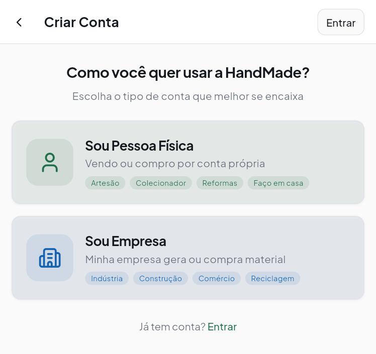
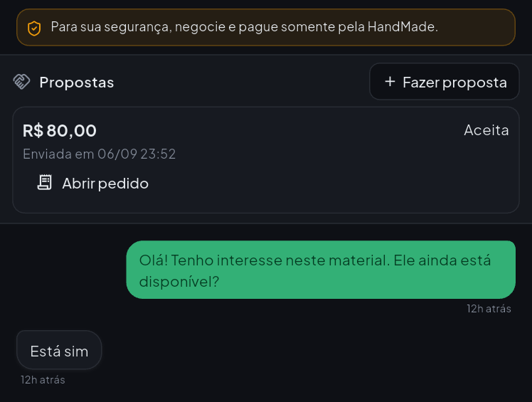
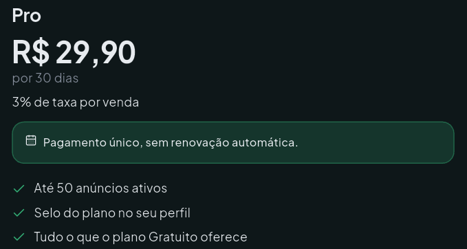

# O aplicativo em uso

[Início](../README.md) · [Método](evolucao-e-metodo.md) · [Engenharia](engenharia.md) · [Resultados](resultados.md)

O HandMade aproxima pessoas, profissionais e empresas que possuem ou procuram materiais reutilizáveis. O foco é facilitar a descoberta e a negociação; a entrega dos materiais é combinada entre as partes.

## Uma jornada de ponta a ponta

1. Explorar categorias e buscar um material.
2. Consultar fotos, condição, modalidade e preço do anúncio.
3. Conversar e registrar uma proposta.
4. Acompanhar o pedido e, nos testes, o pagamento.
5. Receber atualizações e consultar o histórico.

O vendedor também pode criar e gerenciar anúncios. A aplicação contempla favoritos, planos, impulsionamento de anúncios, avaliações e recursos de ajuda e privacidade. Pagamentos e contratações demonstrados pertencem exclusivamente ao ambiente de testes.

## Capturas reais

As imagens são recortes de execuções Android do aplicativo Flutter, utilizados nas validações do projeto. Os recortes preservam proporções e removem barras do ambiente, identificação de contas e áreas desnecessárias. Não são telas geradas nem simulações do aplicativo. Valores e conversas exibidos são demonstrativos.

### Descoberta de materiais

Categorias e ações orientam a primeira navegação. A identidade visual combina verde, ícones reconhecíveis e temas claro e escuro.

### Pessoas e empresas

A entrada distingue o contexto de uso sem exigir que o usuário conheça a estrutura do sistema. A imagem mostra somente a escolha do tipo de conta.

### Conversa e proposta

A negociação reúne mensagens e proposta em um mesmo contexto. O recorte omite o cabeçalho da conversa e a identificação dos participantes. A sincronização de leitura foi verificada separadamente, conforme os [resultados](resultados.md#validacao-funcional).

### Clareza no preço dos planos

A revisão de interface passou a priorizar o valor em reais e a duração, com a taxa em posição secundária. Esta imagem demonstra a hierarquia visual; não é uma oferta comercial. A contratação permanece em Sandbox.

## Decisões de produto

- **Uma conta, diferentes necessidades:** pessoas e empresas têm contextos próprios; comprar e vender são atividades dentro do produto.
- **Informação antes da decoração:** modalidade e preço precisam continuar legíveis mesmo quando a foto tem muito contraste.
- **Continuidade da negociação:** conversa, proposta e pedido ajudam o usuário a acompanhar o andamento de uma operação.
- **Avisos úteis:** as notificações devem orientar a retomada do aplicativo e evitar alertas redundantes durante a conversa aberta.
- **Transparência:** ajuda, termos e recursos de privacidade fazem parte da experiência.

## Estágio atual

A entrega validada é Android em Development, distribuída a convidados. Há testes reais de notificações e chat nesse ambiente, além das suítes automatizadas. A publicação comercial, pagamentos reais, uma entrega iOS e a validação em uma gama maior de aparelhos não são resultados desta etapa.

O projeto propõe facilitar o reaproveitamento de materiais. Ainda não há medição de redução de resíduos, impacto econômico ou adoção comercial que permita apresentar esses benefícios como resultados comprovados.
