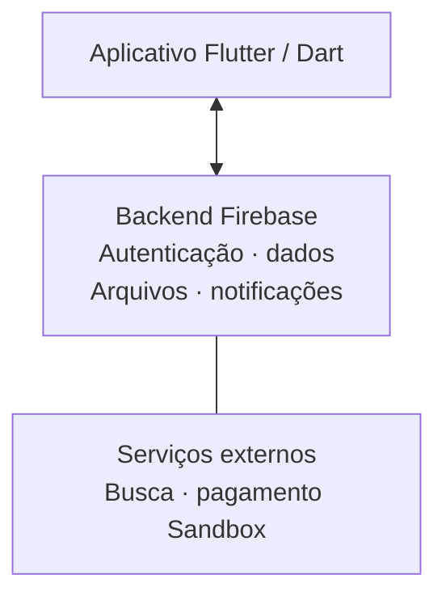

# Engenharia e qualidade

[Início](../README.md) · [Aplicativo](aplicativo.md) · [Método](evolucao-e-metodo.md) · [Resultados](resultados.md)

## Arquitetura em alto nível

O diagrama mostra responsabilidades gerais. A experiência no dispositivo se apoia em serviços de persistência, comunicação e integrações. Não é um diagrama de implantação ou de modelagem interna.

| Tecnologia | Papel no trabalho |
| --- | --- |
| Flutter e Dart | Aplicativo Android, interface e navegação |
| Firebase | Autenticação, dados, arquivos e notificações |
| Cloud Functions e TypeScript | Operações e integrações do backend |
| Algolia | Busca de anúncios |
| Stripe | Pagamentos exclusivamente TEST/Sandbox |
| GitHub Actions | Integração contínua e controle da qualidade |
| Firebase App Distribution | Distribuição Development a testadores convidados |
| React, Vite e TypeScript | Prototipação histórica da interface |

O uso dessas ferramentas foi acompanhado de validação do comportamento integrado. A escolha de Flutter também permitiu evoluir a interface a partir do protótipo sem tratar suas simulações como funcionalidades já implementadas.

## Segurança como requisito de qualidade

A aplicação considera identidade, autorização de acesso, privacidade das informações e proteção das operações de negócio. Testes verificam comportamentos permitidos e negados. Recursos de conta e privacidade fazem parte do produto.

As integrações de pagamento são avaliadas em Sandbox. A entrega para testes é restrita, e os ambientes de desenvolvimento e operação comercial têm finalidades distintas. Esses cuidados não equivalem a uma certificação de segurança, conformidade integral com a LGPD ou garantia de ausência de vulnerabilidades.

## Processo de integração e distribuição

**Alteração proposta → revisão e verificações → integração aprovada → geração e verificação do aplicativo → distribuição Development.**

O processo utiliza proteção de integração, análise estática e suítes automatizadas. A entrega do aplicativo inclui assinatura, verificação e progressão de versão para permitir atualização pelos testadores. A distribuição registrada foi automatizada, sem transformar o pacote do aplicativo em download público.

Uma falha nas verificações bloqueia a continuidade prevista do fluxo. A equipe trata a causa e executa novamente os controles pertinentes. Documentação e alterações no produto recebem verificações proporcionais ao seu escopo.

## Desafios e aprendizados

- **Tamanho do aplicativo:** o artefato e seu empacotamento foram revisados, com comparação equivalente de tamanho.
- **Carregamento:** a espera por dados e imagens foi investigada com amostras de rede e teste controlado de transferência.
- **Leitura das mensagens:** a sincronização da conversa e dos indicadores foi corrigida e verificada por testes automatizados e execução real.
- **Notificações:** os avisos e a navegação após o toque foram revistos e avaliados em diferentes estados do Android.
- **Legibilidade:** a posição da modalidade e a hierarquia do preço foram ajustadas, com inspeção visual e variações de layout.

Os resultados dessas melhorias estão [quantificados e delimitados](resultados.md). O aprendizado central foi investigar o comportamento e comparar evidências antes de escolher uma correção.
